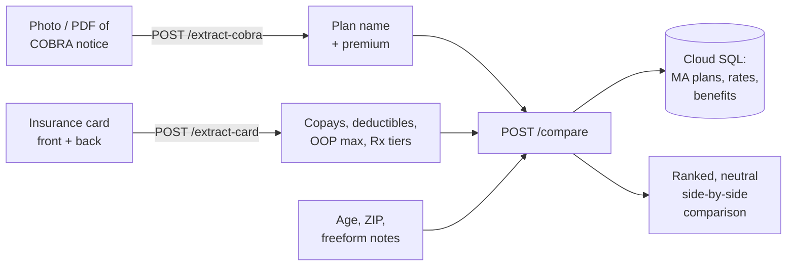

# COBRA vs. MA Health Connector — Comparison API

An AI-assisted API that helps Massachusetts residents who have lost employer health coverage decide whether to keep their expensive **COBRA** continuation plan or switch to a subsidized **MA Health Connector** marketplace plan.

<p>
  
  
  
  
  
</p>

### ▶ Try it live — [cobravsma.kerjasama.dev](https://cobravsma.kerjasama.dev)

> This repository is the **backend API** behind that tool. The web front end (React + Vite) is maintained in a separate repository.

---

## The problem

When someone leaves a job in Massachusetts, they can continue their existing health plan through COBRA — but they now pay the *full* premium (often $700–$2,500/month) with no employer contribution. Many don't realize the state's Health Connector marketplace may offer comparable coverage for a fraction of the cost, sometimes with income-based subsidies.

Comparing the two is genuinely hard: COBRA paperwork and insurance cards are dense and inconsistent, marketplace plans number in the dozens per region, and the tradeoffs (premium vs. deductible vs. network vs. out-of-pocket max) are easy to get wrong. This API does the heavy lifting — reading the documents, matching against the right regional plans, and producing a **neutral, side-by-side comparison** without ever telling the user what to choose.

---

## How it works

The web app walks the user through a short wizard; this API backs each step.



1. **Extract** — Claude's vision capability reads a photo or PDF of the user's COBRA election notice and their insurance card, pulling out structured plan details (premiums, copays, deductibles, out-of-pocket maximums, Rx tiers).
2. **Match** — The user's ZIP is mapped to one of Massachusetts' 7 rating areas, then age- and region-appropriate Health Connector plans are pulled from Postgres, prioritizing the user's current plan *type* (HMO/PPO/EPO) and adjacent metal tiers.
3. **Compare** — Claude ranks the strongest alternatives and produces a factual, bullet-structured comparison for each — premium savings, deductible/OOP deltas, network caveats, and copay changes — while respecting the user's freeform "must-haves" as hard constraints.

---

## Engineering highlights

A few decisions worth calling out:

- **Structured LLM output, not prompt-and-pray.** Every model call is typed end-to-end with [`instructor`](https://github.com/instructor-ai/instructor) + Pydantic, so extraction and comparison responses are validated objects — with automatic retries on schema mismatch — rather than free-form text that needs parsing.
- **Neutral by design.** The comparison prompt is explicitly instructed to present tradeoffs and *never* recommend a plan. Health decisions stay with the user; the tool just makes the numbers legible.
- **Streaming keepalive for long calls.** The `/compare` call can take 60–100s. The endpoint streams keepalive whitespace every 5s so mobile Safari doesn't drop the connection mid-request, then flushes the JSON body as the final chunk.
- **Passwordless database access.** Cloud SQL is reached through the Cloud SQL Python Connector with **IAM authentication** — no DB passwords are stored or shipped anywhere.
- **Bot protection at the edge of every mutating call.** Each endpoint verifies a **Cloudflare Turnstile** token before doing any work, and gracefully no-ops verification in local dev.
- **Testable by construction.** Database, LLM, and connector clients are all lazily initialized, so the app imports (and the 64-test suite runs) with no cloud credentials present.

---

## API reference

| Method | Path              | Purpose |
|--------|-------------------|---------|
| `POST` | `/extract-cobra`  | Extract plan name + medical/dental premiums from a COBRA election notice (JPEG, PNG, or **PDF**). |
| `POST` | `/extract-card`   | Extract benefit details (copays, deductibles, OOP max, Rx tiers) from the front (required) and back (optional) of an insurance card. |
| `POST` | `/compare`        | Rank the best Health Connector alternatives and return a side-by-side comparison. Streams JSON. |
| `GET`  | `/health`         | Liveness check. |

All extraction endpoints take `multipart/form-data` (the file plus a `turnstile_token` field). `/compare` takes JSON. Interactive OpenAPI docs are available at `/docs` when the service is running.

<details>
<summary><strong>Example — <code>POST /compare</code></strong></summary>

```jsonc
// Request
{
  "age": 42,
  "zip_code": "02139",
  "medical_plan_name": "Blue Care Elect Preferred",
  "medical_carrier": "Blue Cross Blue Shield of MA",
  "medical_monthly_premium": 812.50,
  "card_data": {                 // optional — from /extract-card, null if skipped
    "plan_type": "PPO",
    "deductible_individual": 2000,
    "oop_max_individual": 6000,
    "pcp_copay": 30,
    "specialist_copay": 50
  },
  "medical_notes": "I need to keep my therapist who is out of network",
  "turnstile_token": "..."
}

// Response (abridged)
{
  "cobra_summary": { "...": "echo of the parsed current plan" },
  "medical_suggestions": [
    {
      "plan_name": "...",
      "carrier": "...",
      "monthly_premium": 410.00,
      "monthly_savings": 402.50,
      "comparison": [
        { "service": "Monthly Premium", "cobra_value": "$812.50", "alternative_value": "$410.00" },
        { "service": "Deductible",      "cobra_value": "$2,000",   "alternative_value": "$3,500" }
      ],
      "reasoning": "• Premium: Saves $402/month ($4,830/year) ..."
    }
  ],
  "dental_suggestions": [],
  "overall_summary": "..."
}
```
</details>

---

## Tech stack

| Layer            | Choice |
|------------------|--------|
| API framework    | FastAPI + Uvicorn |
| Language         | Python 3.12 |
| AI               | Anthropic Claude Haiku 4.5 (vision + reasoning) via `instructor` |
| Data validation  | Pydantic v2 |
| Database         | PostgreSQL on Google Cloud SQL (IAM auth) |
| Bot protection   | Cloudflare Turnstile |
| Hosting          | Google Cloud Run (containerized, scale-to-zero) |
| CI image build   | Google Cloud Build + Artifact Registry |

---

## Project structure

```
src/
├── main.py                 # FastAPI app, CORS, router registration, /health
├── schemas.py              # Pydantic models: extraction, request & response contracts
├── zip_to_rating_area.py   # MA ZIP → 1 of 7 rating areas
├── clients/
│   ├── llm.py              # Shared Anthropic + instructor client (lazy)
│   ├── db.py               # Cloud SQL connector + SQLAlchemy engine (lazy, IAM auth)
│   └── turnstile.py        # Cloudflare Turnstile verification
└── routes/
    ├── extract_cobra.py    # POST /extract-cobra
    ├── extract_card.py     # POST /extract-card
    └── compare.py          # POST /compare — candidate selection + ranking + streaming
tests/                      # 64 tests covering extraction, schemas, and comparison logic
```

---

## Local development

Requires Python 3.12+.

```bash
# 1. Create a virtual environment and install dependencies
python -m venv .venv && source .venv/bin/activate
pip install -r requirements.txt

# 2. Configure environment
cp .env.example .env      # then fill in your ANTHROPIC_API_KEY

# 3. Run the API
uvicorn src.main:app --reload --port 8080
```

Then open **http://localhost:8080/docs** for the interactive API explorer.

**Environment variables** (see `.env.example`):

| Variable                   | Notes |
|----------------------------|-------|
| `ANTHROPIC_API_KEY`        | Required for the extraction and comparison endpoints. |
| `TURNSTILE_SECRET_KEY`     | Leave empty to skip captcha verification in local dev. |
| `INSTANCE_CONNECTION_NAME` | Cloud SQL instance; only needed for `/compare` against a live database. |
| `DB_NAME`, `DB_USER`       | Cloud SQL database and IAM user. |

> The extraction endpoints (`/extract-cobra`, `/extract-card`) work with just an `ANTHROPIC_API_KEY` — no database required.

---

## Testing

```bash
python -m pytest tests/ -v
```

The suite (64 tests) covers document-extraction wiring, request/response schemas, ZIP-to-rating-area mapping, metal-tier inference, candidate selection, and prompt construction. Cloud clients are mocked, so no credentials are needed to run it.

---

## Deployment

The service is containerized and deployed to Google Cloud Run. `deploy.sh` is idempotent and provisions everything it needs — Artifact Registry repo, service account, Cloud SQL IAM user, Secret Manager entries, and IAM bindings — before building via Cloud Build and rolling out:

```bash
./deploy.sh
```

Runtime secrets (`ANTHROPIC_API_KEY`, `TURNSTILE_SECRET_KEY`) are injected from Google Secret Manager; the database is reached over the Cloud SQL connection without a password.

---

## Notes

This is a personal project built under [Kerjasama](https://kerjasama.dev). Plan, rate, and benefit data reflect Massachusetts filings and are used to *inform* a comparison — the tool is not insurance advice and does not recommend or sell any plan.
